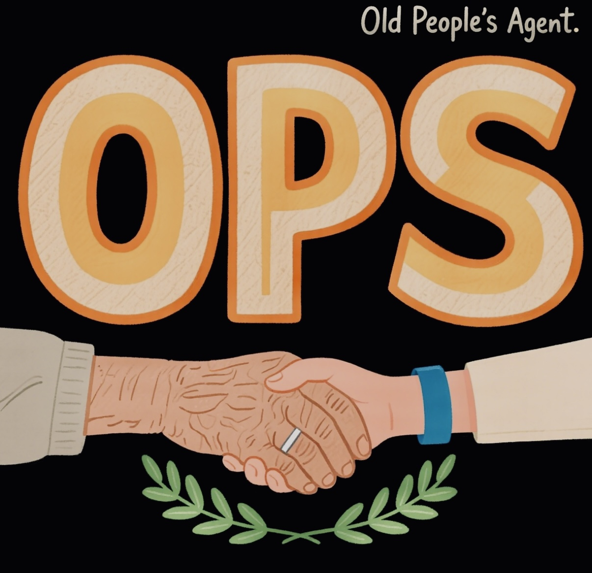
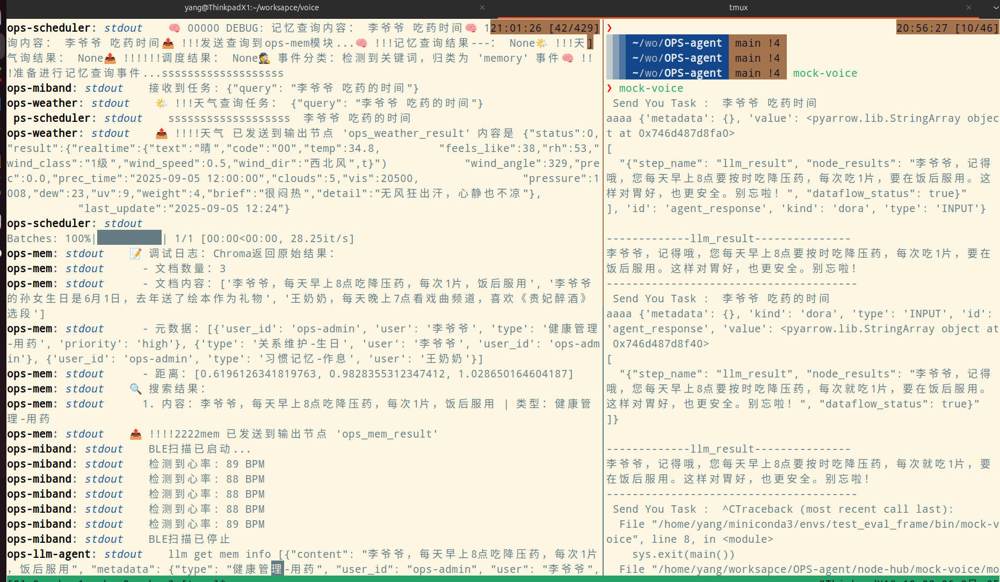

# OPS(Old People's) Agent

> 背景：toB 系列产品，旨在为老年人提供便捷、安全的智能生活体验。OPS Agent 致力于提升老年人的生活质量与安全性。
>


## 概述

💡 OPS Agent 是基于[**mofa-ai**](https://github.com/mofa-org/mofa)框架设计与打造， 专为老年人设计的智能助手，遵循成为老年人的守护者的初心，为其提供覆盖**记忆**、 **健康**、 **天气**三大类型的核心服务。

## 核心功能

- 记忆：帮助老年人记住重要信息，如用药习惯、亲朋的联系方式等。
- 健康：实时上报心率数据, 进行信息整合和处理分析。
- 天气：提供实时天气信息，帮助老年人合理安排出行和活动。

## 创新设计

- **自然语言交互**：老年人可以通过语音或文字与OPS Agent进行交流，无需复杂的操作。
- **硬件集成**：通过蓝牙BLE协议与MiBand6手环设备进行集成, 实时上报健康数据。
- **向量数据库**：应用北京智源研究院BAAI/bge-small-zh-v1.5模型和向量数据库存储和检索，确保记忆的准确性。
- **中心调度节点**：ops-scheduler 作为中心调度节点，与记忆模块, 智能硬件设备, 天气MCP服务无缝对接。

## 关键数据流说明

🌳 OPS Agent系统通过中心调度节点(ops-scheduler)协调各模块：

1. 接收用户输入（语音/文本）
2. 分发请求到记忆/天气模块
3. 与智能硬件设备交互

详细数据流图请参考：[OPS Agent 数据流图](./examples/ops-agent/ops_agent_dataflow-graph.html)


## 安装与使用

### v0.1 模拟语音输入输出版本

🚀 快速开始

版本0.1, 语音输入输出功能用terminal去模拟,  用于演示OPS Agent的核心功能，包括记忆、健康、天气三个模块。

```bash
# 准备框架
pip install mofa-ai
# 蓝牙BLE协议采集
pip install bleak

# 准备ops agents
git clone https://github.com/yangrudan/OPS-agent.git
cd examples/ops-agent
dora up
dora build ops_agent_dataflow.yml
dora start ops_agent_dataflow.yml

# 另一个终端
mock-voice
李爷爷 吃药时间
```

运行结果



### v0.2 VAD+ASR+TTS版本

总体流程与v0.1版本一致, 增加语音识别和语音合成功能, 实现语音输入输出.

```bash
# 准备框架
pip install mofa-ai
# 蓝牙BLE协议采集
pip install bleak
# 流式语音识别
pip install websocket-client==1.4.2
pip install pyaudio

# 更换路径
cd examples/ops-agent-asr-tts

# 启动
dora up
dora build ops_agent_asr_tts_dataflow.yml
dora start ops_agent_asr_tts_dataflow.yml
```

运行结果


## 难点和突破

**问题1**: 开启蓝牙广播后, 小米手环获取心率数据为0xff(255)

[问题1](./docs/challenge/Q1.JPG)

**解决方式1**: 通过开启运动模式, 获取心率数据正常

[解决方式1](./docs/challenge/A1.png)

**问题2**: 模糊搜索(下图🔍附近为搜索结果)

老年人搜索习惯是 “用简化关键词找具体人 / 事”（如 “奶奶” 对应 “王奶奶”），这类匹配的语义相似度通常在0.5-0.6之间。若坚持固定的阈值，会过滤掉合理结果, 李爷爷用药时间匹配成功, 但是对奶奶进行搜索, 未匹配.

[问题2](./docs/challenge/Q2.png)

**解决方式2**: 基于一些模糊的表达, 动态调整阈值(todo)

**问题3**: 本地基于CPU侧部署的FunASR模型的语音识别不准确, "你好"会识别成"杭", 有时候未识别.

[问题3](./docs/challenge/Q3.png)

**解决方式3**: 采用讯飞开放平台提供的语音识别服务

[解决方式3](./docs/challenge/A3.png)

**问题4**: 使用pyaudio找不到GLIBC

[问题4](./docs/challenge/Q4.png)

**解决方式4**: 检查系统环境, 更新软链接

[解决方式4](./docs/challenge/A4.png)

## 感谢

感谢以下项目提供的支持：

- [mofa-ai](https://github.com/mofa-org/mofa)
- [智源研究院 BAAI/bge](https://huggingface.co/BAAI/bge-small-zh)
- [MiBAND](https://github.com/mengxin239/miband4-heartrate)
- [天气API](https://www.apispace.com/)
- [讯飞开放平台](https://console.xfyun.cn/services/new_rta)
- [阿里巴巴语音识别 FunASR](https://pypi.org/project/funasr/)

## 贡献

欢迎您的加入，共同为OPS Agent的发展贡献力量！

## 👋 展望

1. 进行每天的健康数据, 活动轨迹的存储与分析, 提供**健康报告**.
2. 支持更多场景，如新闻播报, 🎶戏曲播放, 日常规划, 购物提醒等.
3. 支持更多的智能硬件设备, 如**智能手表, 👓智能眼镜**等.
4. 提高语音识别和自然语言处理能力，比如对**方言**更好的识别, 以实现更智能的交互.
5. 增强⚠️**安全防护机制**, 在异常情况下进行一些主动积极的处理方式(如呼叫紧急联系人), 保障老人的安全.
